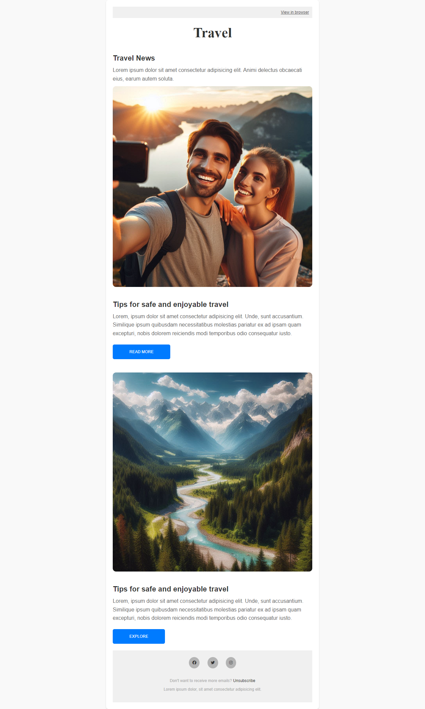

# HolaJuniors - Crea una plantilla para una newsletter en HTML
Desafío de programación de [HolaJuniors](https://holajuniors.com).

Nuestros desafíos te ayudan a mejorar tus habilidades de programación mediante la creación de proyectos realistas.

## Requerimientos del proyecto: [Crea una plantilla para una newsletter en HTML](https://holajuniors.com/challenges/crea-una-plantilla-para-una-newsletter-en-html)

Tu tarea consiste en construir una plantilla de email siguiendo el diseño de la imagen de referencia que se encuentra debajo de esta descripción. Deberás seguir los estándares de HTML y CSS para emails, sin utilizar librerías o frameworks externos.

Puedes seguir estas recomendaciones: https://templates.mailchimp.com/getting-started/html-email-basics/

Este desafío busca evaluar tu habilidad técnica utilizando los estándares de HTML más compatibles pero sin descuidar los detalles de diseño y los espacios entre los elementos.

¡Buena suerte!

## Stack utilizado
HTML y CSS

## Screenshots y vista previa
